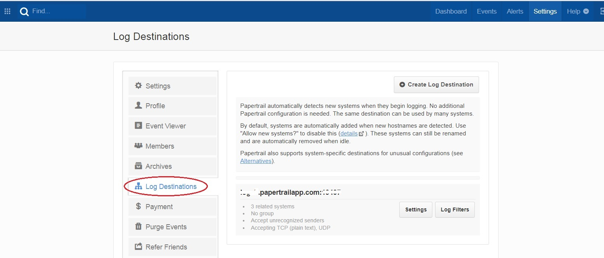
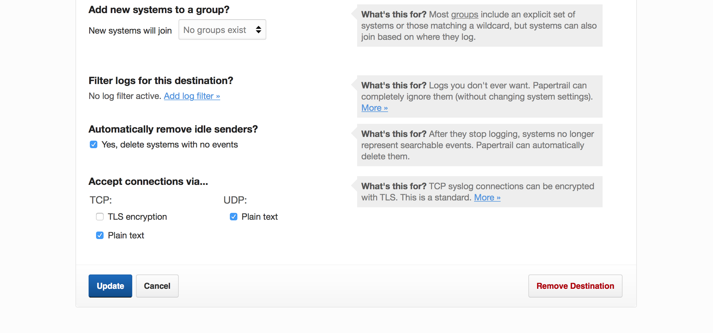
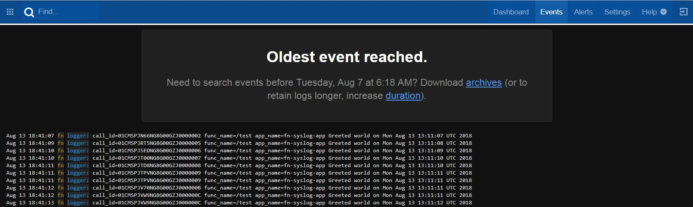

# Exporting function logs to remote syslog service

Fn allows you to push the [function logs to a syslog endpoint](https://github.com/fnproject/fn/blob/master/docs/operating/logging.md#remote-syslog-for-functions). This is an example of how to configure it and test it our using [Papertrail](https://papertrailapp.com)

## step 0 

### create a Papertrail account

Papertrail is a hosted log management service. You can sign up for a [free account](https://papertrailapp.com/signup?plan=free) for the purposes of this tutorial

### create log destination

Go to Settings (top right hand corner) and click on Log Destinations. Create a log destination.

### make a note of your *destination*

On the Papertrail [**Settings**](https://papertrailapp.com/account) choose **Log Destinations** (from the options in the left) and copy the endpoint - you'll use this in subsequent steps



### For TCP, unselect TLS and select Plain Text

As shown below ... Settings > Log Destination > my.papertrail.com:4242 > Settings

For TCP > Unselect TLS and Select Plain Text



## Go..

- start Fn server - `fn start`
	- Ensure you are running the latest fn cli (v0.4.153 or above) and fn server (v0.3.545 or above)
	- If you have older version please update the CLI and the server
	- To update the fn cli run the following command
	```
	curl -LSs https://raw.githubusercontent.com/fnproject/cli/master/install | sh
	```
	- To update the fn server run the following command
	```
	fn update sv
	```
- Switch context - `fn use context default`
- Set registry to a dummy name - `export FN_REGISTRY=fndemouser`
- Create an application with `syslog` endpoint info - `fn create app fn-syslog-app --syslog-url tcp://<your papertrail syslog endpoint>` e.g. `fn create app fn-syslog-app --syslog-url tcp://my.papertrail.com:4242`

## Deploy

- Clone or download this repo
- `cd fn-syslog-example`
- `fn -v deploy --app fn-syslog-app --local --no-bump` (`-v` will activate verbose mode)

Your function should now be deployed. Check it

`fn inspect app fn-syslog-app`

You will see something similar to this - notice the `syslog_url` configuration

	{
	        "created_at": "2018-08-13T11:39:48.943Z",
	        "id": "01CMSHBGTFNG8G00GZJ0000001",
	        "name": "fn-syslog-app",
	        "syslog_url": "tcp://my.papertrailapp.com:4242",
	        "updated_at": "2018-08-13T11:39:48.943Z"
	}

List the function using `fn list functions fn-syslog-app`

		NAME            IMAGE
		fn-syslog-func  fn-syslog-func:0.0.1

## Test

Test using Fn CLI with `fn invoke` command

### Invoke

- `fn invoke fn-syslog-app fn-syslog-func`
- `echo -n 'fun with fn!' | fn invoke fn-syslog-app fn-syslog-func` 

you can repeat this multiple times

### Check your Papertrail a/c

Hop over to your Papertrail [dashboard](https://papertrailapp.com/dashboard) and click **Events** (top right) to see the logs


